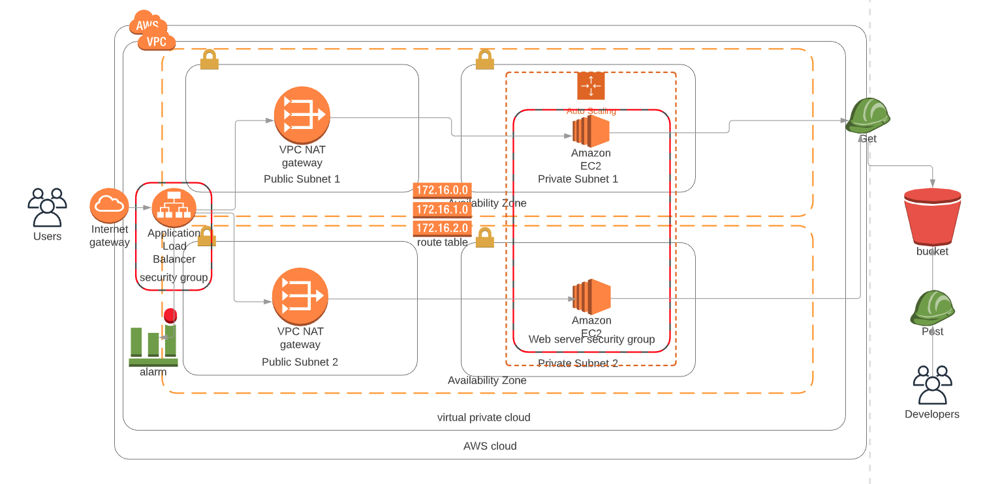

# Project 2 Deploy a high availability web app using cloudformation



## Introduction

In this project, we will deploy web servers for a highly available web app using CloudFormation. We will write the code that creates and deploys the infrastructure and application for an Instagram-like app from the ground up. We will begin with deploying the networking components, followed by servers, security roles and software. After the basic structure of network and servers are set up, we have additionally also set a cloudwatch alarm for notifying us when the total error rate exceeds 1. We have set up a SNS service to receive email in the scenario of this alarm getting triggered.

## Website link

The project is available at: http://proje-webap-ob9igc9k2hgt-367436481.ap-south-1.elb.amazonaws.com/

## Instructions

```
a) ./create.sh project2networkstack network.yml network-parameters.json

```

```
b) ./create.sh project2serverstack servers.yml server-parameters.json 
```
