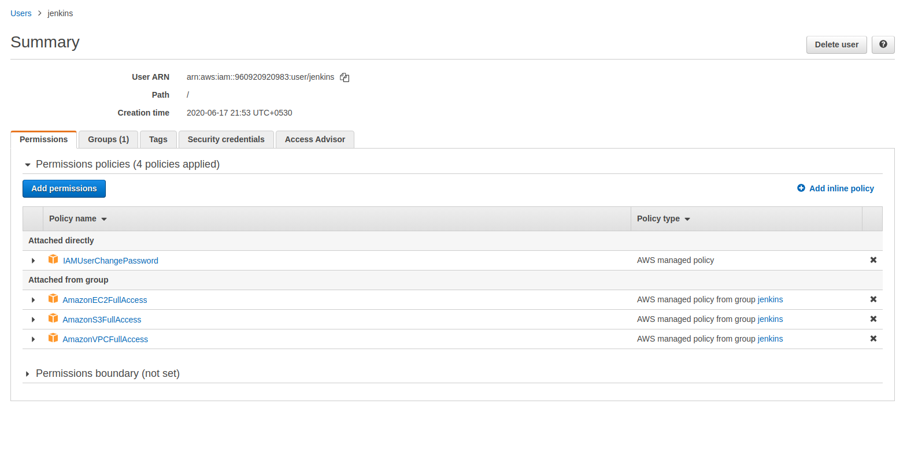

# Github URL: 

- https://github.com/sagarnildass/static

## A) Introduction

1. In this project, we will build a complete CI/CD pipeline with Jenkins and deploy it in AWS as a static html template in a s3 bucket.

2. In addition, we will build two additional branches, two additional buckets for them and two similar html files for them to be deployed in their respective buckets. Based on which branch the code has been pushed in, the pipeline structure will change.

3. In addition to the basic requirements, we have also implmented aquascanner micro security for finding any vulnerability and also a curl request to the respective buckets to check that they indeed exist before deploying to them.

## B) Steps

1. Log in to the AWS management console, as a Root user. Find and select the IAM (Identify and Access Management) service.

2. Click on "Group" menu item from the left sidebar. Create a new group and name it "jenkins", and attach the following policies:

	- AmazonEC2FullAccess
	- AmazonVPCFullAccess
	- AmazonS3FullAccess.

3. Create an IAM user

Click on "Users" menu item from the left sidebar. Create a new IAM User, select "Users" from the left sidebar, then "Add user," and use "jenkins" as the user name. Click on both "programmatic access" and "AWS management console access." The defaults for auto-generated password and "users must create a new password at next sign-in" are OK and should be kept. Hit "Next", and add the "jenkins" user to the "jenkins" group. Hit "next," no need to add "Tags." Review, and accept. Capture the Access Key, Secret Access Key, and the password so that you can log in as IAM user in the next step. (easy to just download the csv file).

Copy the IAM User sign-in link from the IAM Dashboard.

