# Github URL: 

- https://github.com/sagarnildass/static

## 1) Introduction

1. In this project, we will build a complete CI/CD pipeline with Jenkins and deploy it in AWS as a static html template in a s3 bucket.

2. In addition, we will build two additional branches, two additional buckets for them and two similar html files for them to be deployed in their respective buckets. Based on which branch the code has been pushed in, the pipeline structure will change.

3. In addition to the basic requirements, we have also implmented aquascanner micro security for finding any vulnerability and also a curl request to the respective buckets to check that they indeed exist before deploying to them.

## 2) Steps

### A) AWS Steps

1. Log in to the AWS management console, as a Root user. Find and select the IAM (Identify and Access Management) service.

2. Click on "Group" menu item from the left sidebar. Create a new group and name it "jenkins", and attach the following policies:

	- AmazonEC2FullAccess
	- AmazonVPCFullAccess
	- AmazonS3FullAccess.

3. Create an IAM user

Click on "Users" menu item from the left sidebar. Create a new IAM User, select "Users" from the left sidebar, then "Add user," and use "jenkins" as the user name. Click on both "programmatic access" and "AWS management console access." The defaults for auto-generated password and "users must create a new password at next sign-in" are OK and should be kept. Hit "Next", and add the "jenkins" user to the "jenkins" group. Hit "next," no need to add "Tags." Review, and accept. Capture the Access Key, Secret Access Key, and the password so that you can log in as IAM user in the next step. (easy to just download the csv file).

Copy the IAM User sign-in link from the IAM Dashboard. The picture below shows the user.


4. Sign in as the new IAM user in a new browser window.

	- First, sign out of the AWS console. Then, use the IAM User sign-in link copied from the previous step.
	- Alternatively, you can login as the root user. Go to IAM dashboard. Click on "Users" menu item from the left sidebar. Select the 'jenkins' user link, and go to the Security credentials tab. Copy the "Console sign-in link".

5. Create a new key pair for access to your instance(s). Choose EC2 as the service after logging in. Select "Key Pairs" from the sidebar on the left, from the "Network and Security" section. Enter the "pipeline" name when prompted. Save the ".pem" file. If you will use an SSH client on a Mac or Linux computer to connect to your Linux instance, use the following command to set the permissions of your private key file so that only you can read it: 

```chmod 400 your_user_name-key-pair-region_name.pem```

6. Launch the EC2 t2.micro for the free tier, pick "Ubuntu 18.04 LTS amd64," review, and when hitting "launch" ensure that an existing pair ("pipeline") from before is selected. If you're not using the right key pair, you cannot log in. Now, an Ubuntu 18.04 t2.micro instance is launched in the AWS EC2, that can be accessed via SSH using the PEM file. The picture below shows the EC2 instance.

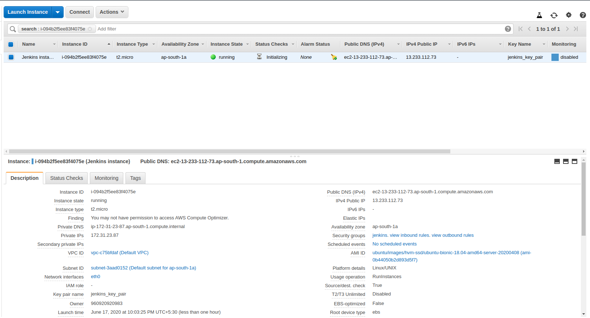

7. Once launched, create a security group for the vm. In the left sidebar, under Network and Security, select "Security Groups." Under name, use: 'jenkins', description: "basic Jenkins security group," VPC should have the default one used. Click Add Rule: Custom TCP Rule, Protocol: TCP, Port Range 8080, Source 0.0.0.0/0 Then add the SSH rule: Protocol: SSH, Port range: 22, From source, use the dropdown and select "My IP."

8. Go back to instances, and right-click the running instance, select Networking and change the security groups. Select the Jenkins security group that was created previously.

9. To connect to your instance using your key pair, follow these steps. Right click your running instance and select "Connect," then follow the instructions to SSH into it. 

### B) Install Jenkins on ubuntu

1. apt update

2. apt upgrade

3. apt install default-jdk

4. wget -q -O - https://pkg.jenkins.io/debian-stable/jenkins.io.key | sudo apt-key add -

5. sudo sh -c 'echo deb https://pkg.jenkins.io/debian-stable binary/ > \
    /etc/apt/sources.list.d/jenkins.list'
    
6. sudo apt-get update

7. sudo apt-get install jenkins

8. sudo systemctl start jenkins

9. sudo systemctl status jenkins

10. sudo systemctl enable jenkins (To enable it at startup)

### C) Set up Jenkins

1. Visit Jenkins on its default port, 8080, with your server IP address or domain name included like this: http://your_server_ip_or_domain:8080. Below is the first screen you see if jenkins is successfully configured.


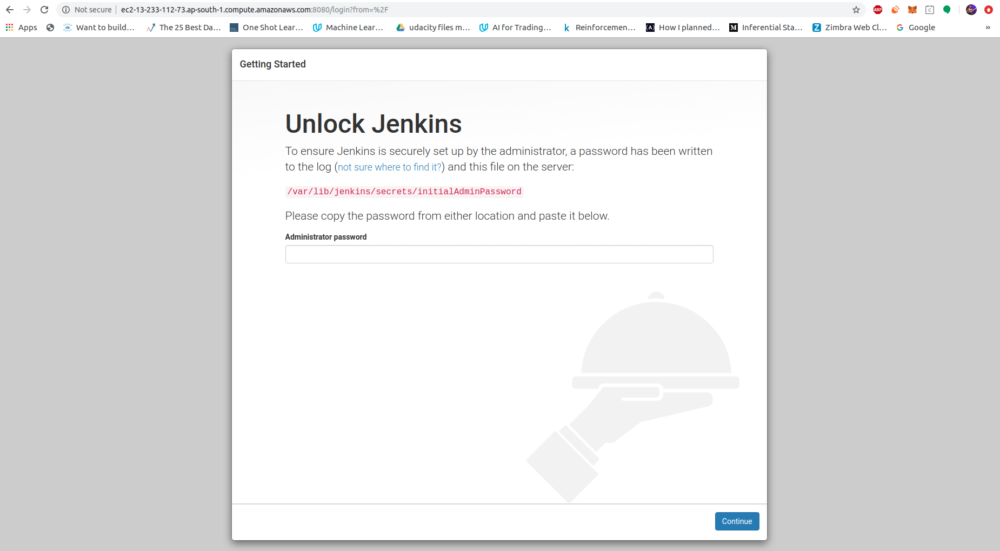

2. Next you will see the "Unlock Jenkins" screen, displaying the location of the initial password. In the terminal, use cat to show the password:

	- sudo cat /var/lib/jenkins/secrets/initialAdminPassword

3. Copy and paste the 32-character alphanumeric password from the terminal into the Admin password field, then Continue.

4. The next screen gives you the choice of installing recommended plugins, or selecting specific plugins - choose the Install suggested plugins option, which quickly begins the installation process.

5. When installation is complete, you are prompted to set up the first admin user. Create the admin user and make note of both the user and password to use in the future.

6. You next see an Instance Configuration page, asking you to confirm the preferred URL for your Jenkins instance. Confirm the address, click save and finish.

### D) Install Blue Ocean plugin

1. "Blue Ocean" and other required plugins need to be installed. Logged in as an admin, go to the top left, click 'Jenkins', then 'manage Jenkins', and select 'Manage Plugins'.

2. Use the "Available" tab, filter by "Blue Ocean," select the first option ("BlueOcean aggregator") and install without a restart.

3. Filter once again for "pipeline-aws" and install, this time selecting "Download now and install after restart."

4. Once all plugins are installed, Jenkins will restart. If it hasn't restarted, run the following in the VM:

5. sudo systemctl restart jenkins

6. Verify everything is working for Blue Ocean by logging in. An "Open Blue Ocean" link should show up in the sidebar. Click it, and it will take you to the "Blue Ocean" screen, where we will have to add a project. Below is a picture of the jenkins home screen with Blue ocean plugin displayed on the navigation bar.

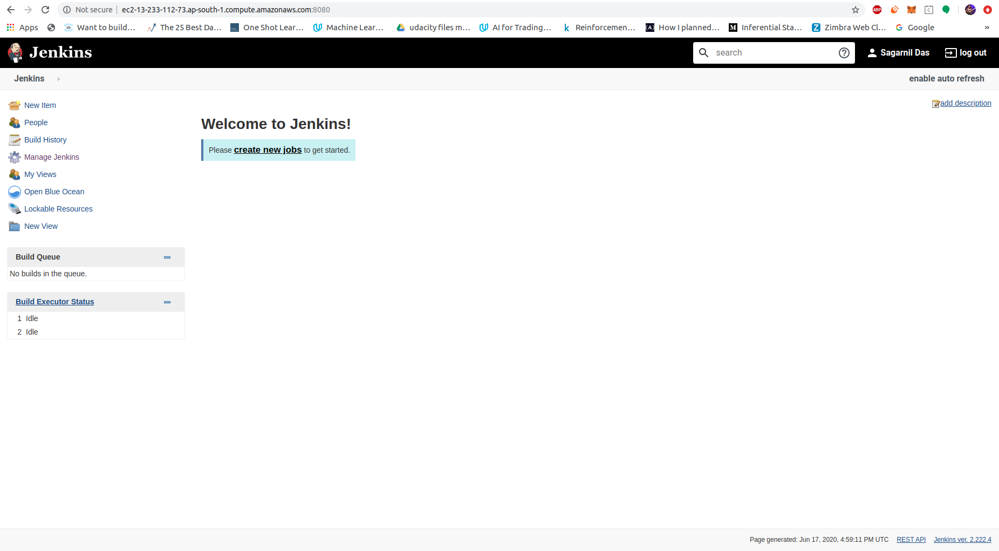

7. A welcome screen will appear, telling you it is time to create your first pipeline.

8. Click "create pipeline."

### E) Set up a GitHub Repository

1. Create a new repository in your GitHub account named 'static'. In the repo, create two files: "index.html" and "Jenkinsfile". The link to my repo: https://github.com/sagarnildass/static

2. Commit and push your changes.

3. Select GitHub from the options available, a token needs to be generated. A link to https://github.com/settings/tokens/new?scopes=repo,read:user,user:email,write:repo_hook needs to be clicked to generate a token for Jenkins to use. You can select the default scopes in the opened link, that defines the access for a personal token for Jenkins.

4. Authenticate in Github, and add a note for what this token is (easier for later removal): "Jenkins Pipeline."

5. Make sure you copy the token - there is no way to see it again!

6. After pasting the token into the form in Jenkins, click "connect", and your account should show up. If your account belongs to multiple organizations, they will be listed - make sure you use your personal account and organization.

7. Next, search for "static" so that the repo is matched, and click "create pipeline."

8. The pipeline should show up with a new run. The picture below shows the initial pipeline

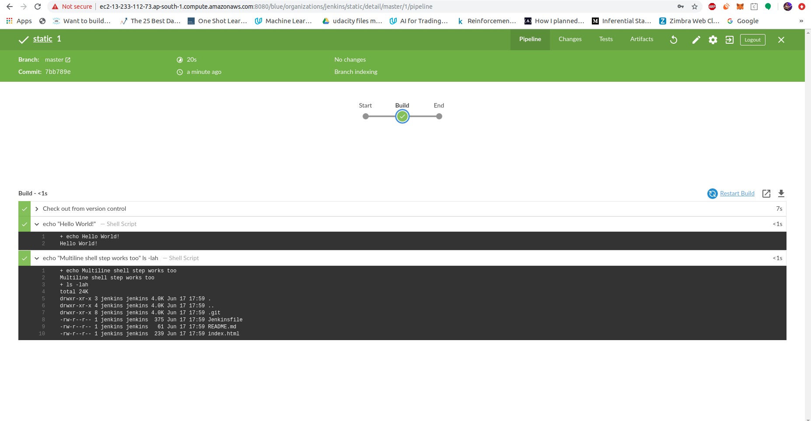

9. In the page where the 'static' job shows, there is a gear icon - click on it to edit the job directly. Find the "Scan repository triggers" and click on "Periodically if not otherwise run," and select an interval of 2 minutes.

### F) Set up AWS credentials in Jenkins

Credentials need to be created so that they can be used in our pipeline.

1. Leave the Blue Ocean GUI, and go back to the main Jenkins page. Then click on the “Credentials” link from the sidebar.

2. Click on "(global)" from the list, and then "Add credentials" from the sidebar.

3. Choose "AWS Credentials" from the dropdown, add "aws-static" on ID, add a description like "Static HTML publisher in AWS," and fill in the AWS Key and Secret Access Key generated when the IAM role was created.

4. Click OK, and the credentials should now be available for the rest of the system.

5. Alternatively, you can also set this up using environment variables in Jenkins: https://serverfault.com/questions/883873/how-give-aws-credential-to-jenkins-pipeline

### G) Set up S3 buckets

1. In order to publish the contents, we need to create a bucket in S3 that has the right permissions to add files and that others can get access to.

2. Log in to the console for the 'jenkins' user that was created in the beginning, and select the 'S3' service.

3. Create a new bucket, and make it a unique name. The system will not let you continue creation if the name is not unique. Remember this name for later configuration.

4. Take note of the region. This will also be used later.

5. Select "next" to configure options, do not select any special options, then hit "next" again.

6. For "Set Permissions," uncheck the "Block all public access." Hit "next" once again, review the settings, and click "continue."

7. The new bucket should be available in the S3 console. Click it to get to the configuration panel for that bucket.

8. Select the "Properties" tab, and click on "Static website hosting." Enable the "Use this bucket to host a website" and type in "index.html" for the Index document. Click "save."

9. Select the "Permissions" tab.

10. Click on "Bucket policy" and add the following:

{
    "Version": "2012-10-17",
    "Statement": [
        {
            "Sid": "PublicReadGetObject",
            "Effect": "Allow",
            "Principal": "*",
            "Action": "s3:GetObject",
            "Resource": "arn:aws:s3:::NAME_OF_BUCKET/*"
        }
    ]
}

11. Replace 'NAME_OF_BUCKET' with the bucket that was just created.

12. Click save, and "Permissions public" should now show in the tab.

### H) Set up pipeline for AWS

1. Go back to your project, and edit "Jenkinsfile." Replace the "Build" stage with "Upload to AWS."

2. This stage should upload the "index.html" file using the region and credentials for AWS.

3. The "withAWS" and "s3Upload" utilities from the "pipeline-aws" plugin should be used. "withAWS" is documented here: https://github.com/jenkinsci/pipeline-aws-plugin#withaws. "s3Upload" is documented here: https://github.com/jenkinsci/pipeline-aws-plugin#s3upload.

**The "credentials" need to match the name given when they were created in Jenkins (see the "Set up AWS credentials in Jenkins" section on this page for reference).**

4. Save, commit, and push. Within minutes, a new run should appear - it should be successful.

5. To verify, go to the URL where the static S3 website is: **http://BUCKET_NAME.s3-website.REGION.amazonaws.com/**. Replace "BUCKET_NAME" with the bucket that was created early, and "REGION" with the according region where the bucket exists.

6. The contents of the "index.html" file should exist there. The picture below shows completed pipeline after the file has been successfully uploaded to S3.

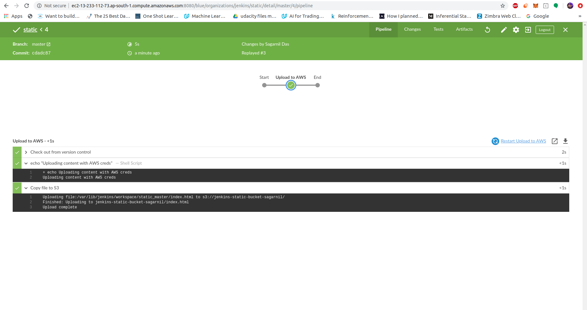

### I) Add another stage in pipeline

1. The index file has an invalid HTML in there. To prevent getting an invalid HTML, we are going to run a linter so that it fails the job if anything gets in that is invalid.

2. Connect to the host where Jenkins is installed, and install the following system dependency: sudo apt-get install -y tidy This would install the tidy linter in the server.

3. Now that the system dependency is installed, add a new stage for linting the HTML in the project, before the "Upload to AWS" stage, that runs the ‘tidy’ utility. Name it "Lint HTML." The command that runs the linter is tidy -q -e *.html.

4. Commit this new change and push to GitHub, then wait a couple of minutes. The build should now FAIL at the linting step, because the HTML is invalid and has an error.

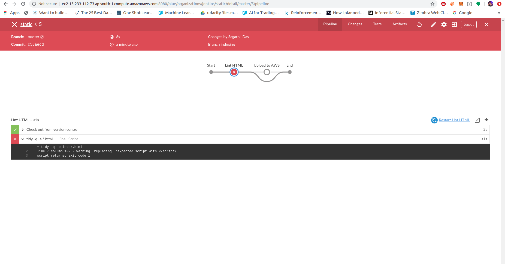

5. Go edit the "index.html" file again, find the invalid portion, and replace it with the correct version so that the linter does not complain. The job should now pass without problems.

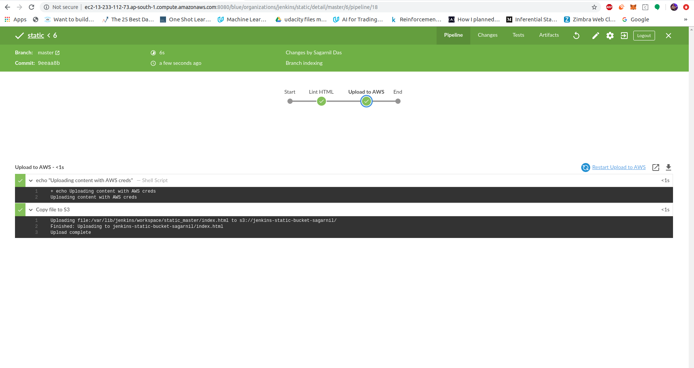

## 3) Additional Steps

### A) Aqua Microscanner

1. A free-to-use tool that scans container images for package vulnerabilities.

2. Install the plugin from manage jenkins

3. In aqua microscanner website, get a token.

4. Put this token in Jenkins --> Configure system --> Aqua MicroScanner --> Aqua MicroScanner

5. Add additional code in Jenkinsfile for microscanner and run the pipeline. The picture below shows microscanner correctly implemented.


### B) Adding additional branches in repo and making a multibranch pipeline

1. In our git repo, we make two additional branches called 'Development' and 'Deployment'.

2. We create two duplicate copies of our index.html and name them **index_development.html** and **index_deployment.html** in our master branch.

3. In these additional two branches, we pull from our master branch and then push them to their respective locations. So now, all the branches are identical.

4. We also create two additional s3 buckets called : jenkins-static-bucket-sagarnil-development and jenkins-static-bucket-sagarnil-deployment apart from the original one which was called jenkins-static-bucket-sagarnil.

5. We change the jenkinsfile and make a logic change such that if the development branch is pushed, then the **index_development.html** will be deployed to **jenkins-static-bucket-sagarnil-development**, if the deployment branch is pushed, then the **index_development.html** will be deployed to **jenkins-static-bucket-sagarnil-deployment** and same for master.

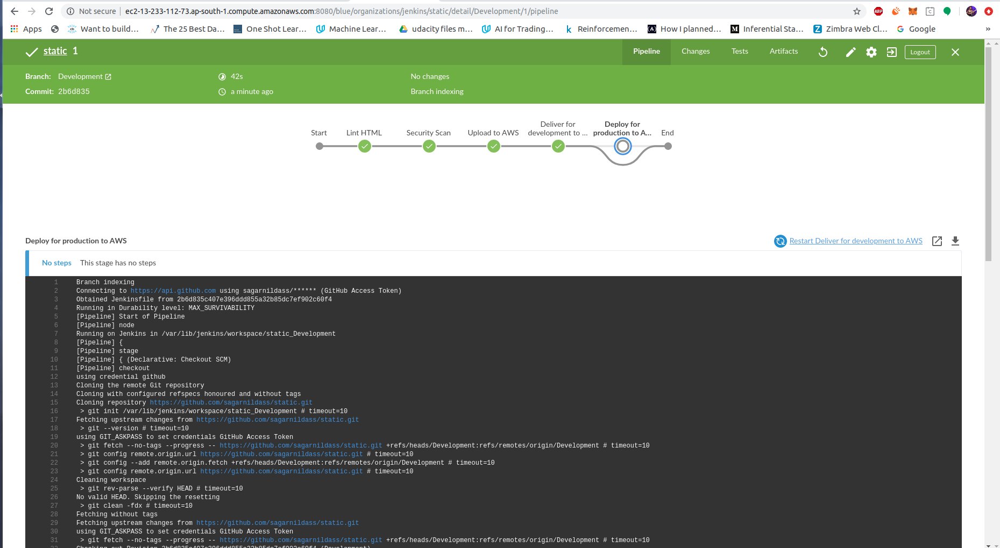

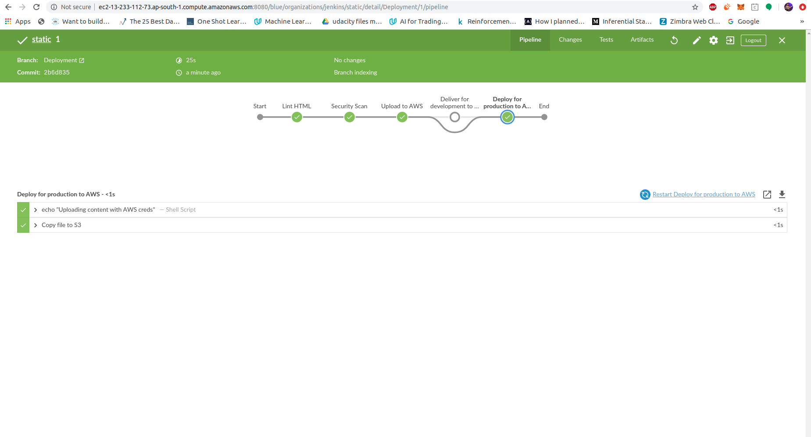

### C) Adding curl scripts to check existence of s3 buckets

6. We also added a shell script condition in our jenkinsfile for curl request to the s3 buckets. Based on which branch is pushed, it's respective s3 bucket will receive a curl request and if the http code is 200 (i.e. ok), only then the html file will be pushed to the respective buckets.


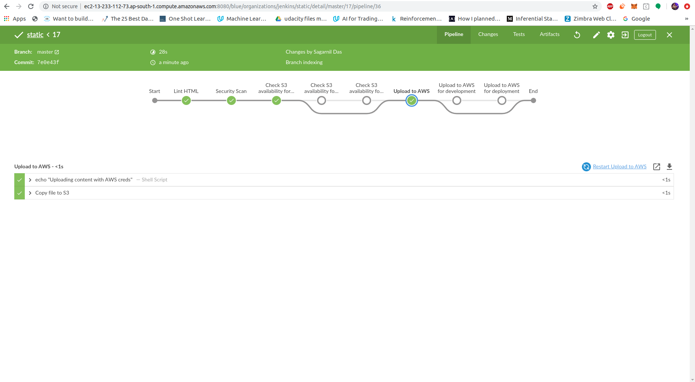

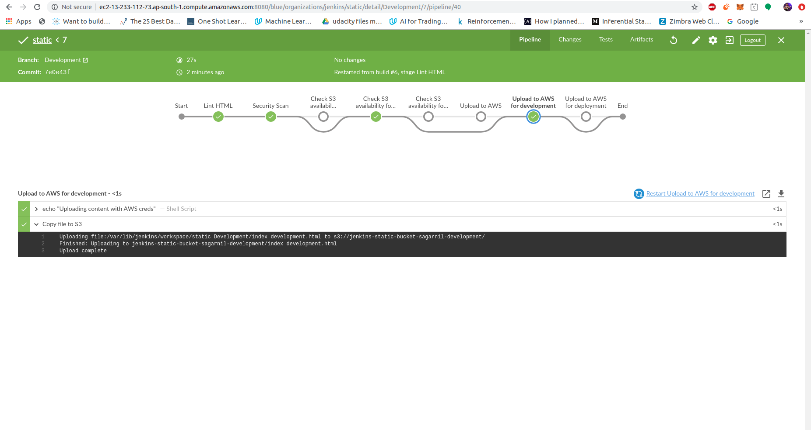

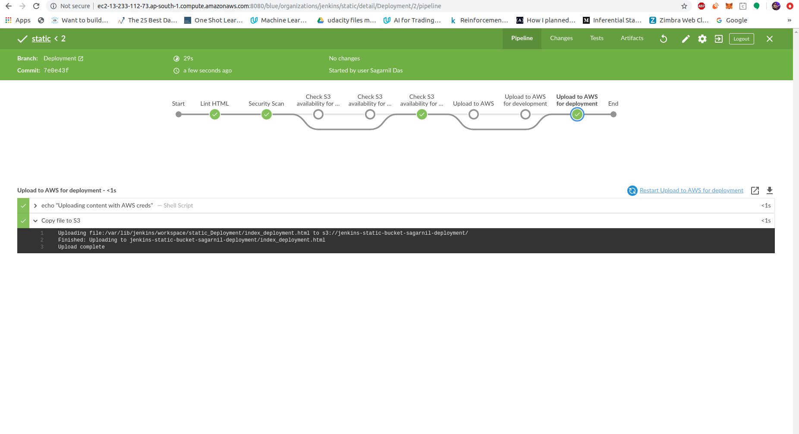


