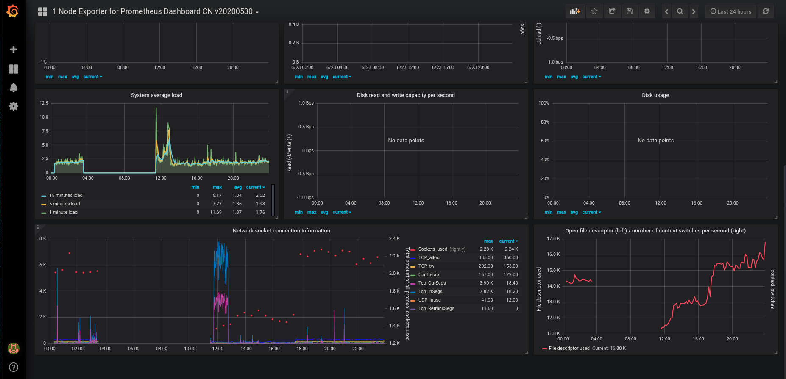
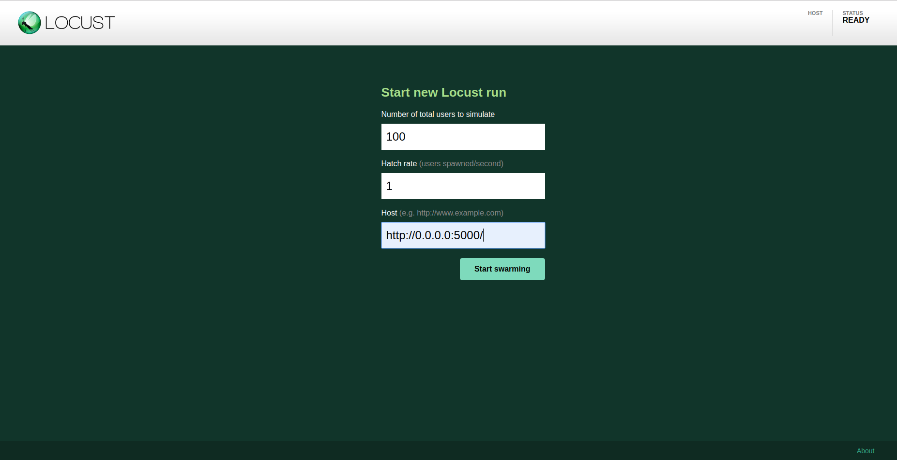
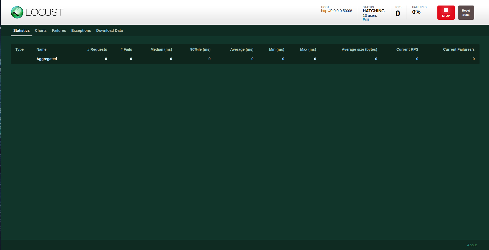

## Project Overview

In this project, you will apply the skills you have acquired in this course to operationalize a Machine Learning Microservice API. 

You are given a pre-trained, `sklearn` model that has been trained to predict housing prices in Boston according to several features, such as average rooms in a home and data about highway access, teacher-to-pupil ratios, and so on. You can read more about the data, which was initially taken from Kaggle, on [the data source site](https://www.kaggle.com/c/boston-housing). This project tests your ability to operationalize a Python flask app—in a provided file, `app.py`—that serves out predictions (inference) about housing prices through API calls. This project could be extended to any pre-trained machine learning model, such as those for image recognition and data labeling.

### Project Tasks

Your project goal is to operationalize this working, machine learning microservice using [kubernetes](https://kubernetes.io/), which is an open-source system for automating the management of containerized applications. In this project you will:
* Test your project code using linting
* Complete a Dockerfile to containerize this application
* Deploy your containerized application using Docker and make a prediction
* Improve the log statements in the source code for this application
* Configure Kubernetes and create a Kubernetes cluster
* Deploy a container using Kubernetes and make a prediction
* Upload a complete Github repo with CircleCI to indicate that your code has been tested

You can find a detailed [project rubric, here](https://review.udacity.com/#!/rubrics/2576/view).

**The final implementation of the project will showcase your abilities to operationalize production microservices.**

---

## Setup the Environment

* Create a virtualenv and activate it
* Run `make install` to install the necessary dependencies

### Running `app.py`

1. Standalone:  `python app.py`
2. Run in Docker:  `./run_docker.sh`
3. Run in Kubernetes:  `./run_kubernetes.sh`

### Kubernetes Steps

* Setup and Configure Docker locally
* Setup and Configure Kubernetes locally
* Create Flask app in Container
* Run via kubectl

### Additional Steps:

1. The following video shows the autoscaling and load balancing of the Kubernetes application:

[Kubernetes load balancing](https://www.youtube.com/watch?v=J2-Wgi6N4Y4&feature=youtu.be)

The steps are as follows:

	a) kubectl scale deployments/udacity-project-4 --replicas=4
	
	b) kubectl get deployments
	
	c) kubectl get pods
	
	LOAD BALANCING: Let’s check that the Service is load-balancing the traffic. To find out the exposed IP and Port we can use the describe service as we learned in the previously Module:
	
	d) kubectl expose deployment/udacity-project-4 --type="NodePort" --port 5000
	
	e) kubectl describe services/udacity-project-4
	
	f) export NODE_PORT=$(kubectl get services/udacity-project-4 -o go-template='{{(index .spec.ports 0).nodePort}}')

	g) curl $(minikube ip):$NODE_PORT
	
	h) kubectl scale deployments/udacity-project-4 --replicas=2
	
	i) kubectl get pods
	
2. Graffana monitoring set up: We have configure graffana and prometheus so that we can monitor different metrics related to the app. The following screenshot shows a sample graffana dashboard with the app deployed and running.

3. Locust load test: A locust load testing is performed on the app locally. Following are the screenshots depicting that:

