# Project: Capstone (Udacity Cloud DevOps Nanodegree)

This is the compliment I received from the reviewer :D

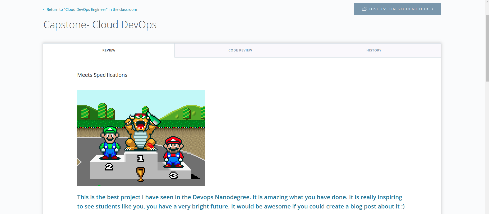

In this project we will apply the skills and knowledge which were developed throughout the Cloud DevOps Nanodegree program. These include:

- Working in AWS
- Using Jenkins to implement Continuous Integration and Continuous Deployment
- Building pipelines
- Working with Ansible and CloudFormation to deploy clusters
- Building Kubernetes clusters
- Building Docker containers in pipelines

We will develop a CI/CD pipeline for micro services applications with rolling deployment. We will take a nodeJS app and dockerize it. Finally we will deploy this in a kubernetes cluster with 3 worker nodes and 1 node balancing instance in AWS. We will use jenkins for the CI/CD. We will also develop your Continuous Integration steps like linting and security scanning for vulnerability and errors in containers. We will also integrate slack with Jenkins to send us notifications at different stages of the pipeline. Finally as post deployment steps, we will perform additional testing by Jenkins whether the app is up and running, check whether it got successfully rolled out and also clean up the docker environment.

# Extra things done in addition to the project rubric

So apart from the basic requirements for this project, the additional steps that we will be doing are as follows:

A) Adding security scanning as a part of the continuous integration process.

B) Integrate Slack with jenkins to send automated messages describing the results of the pipelines.

C) Perform additional post deployments tests : Whether the app is successfully running and also whether it successfully rolled out.

D) Prune docker environment.

E) Map custom Route53 domain with the LoadBalancer DNS name.

The app which we will deploy is the Bcrypt app (https://github.com/felladrin/bcrypt-sandbox) used for encryption and decryption. This is written with nodeJS.

# Complete Steps to be followed

1. Setting up the Jenkins instance - I have used my local ubuntu machine as the Jenkins instance. I also have added additional plugins in it like blue ocean, aqua microscanner, aws pipeline etc. We also have installed the slack integration plugin and set up global variables with a specific workspace to send automated message at different stages of the pipeline.

2. Set up the EKS cluster - We have done it both via cloudformation (infrastructure/eks.yaml) and eksctl. If you use eksctl, the command is:

```eksctl create cluster --name capstoneclustersagarnil --version 1.16 --nodegroup-name standard-workers --node-type t2.medium --nodes 3 --nodes-min 1 --nodes-max 4 --node-ami auto --region ap-south-1```

3. Now in order to deploy our app in this cluster, we created a Jenkinsfile which does the following:

   - Send a message in slack at the start of the build with job name, build url and build number.
   
   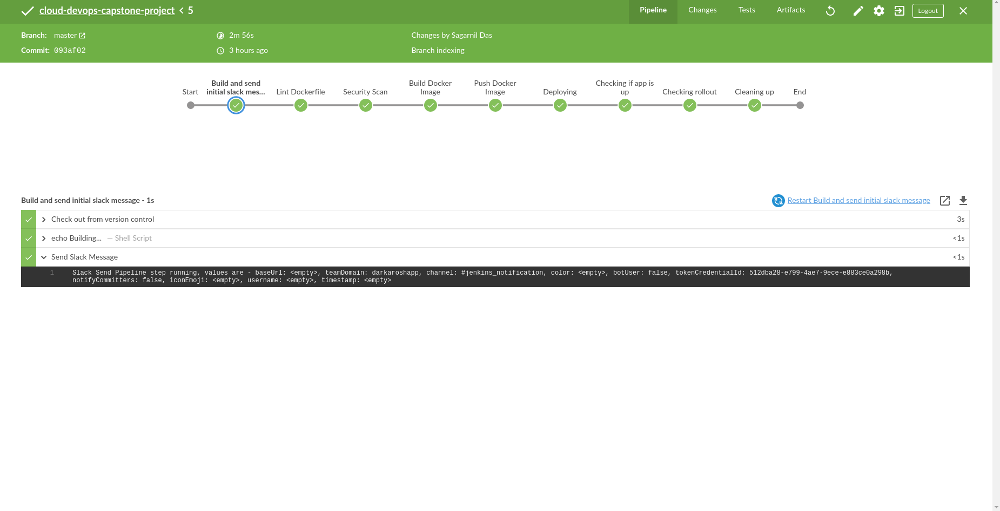
   
   - Hadolints the dockerfile. We tried both scenarios with an erroneous docker file and then correcting it.
   
   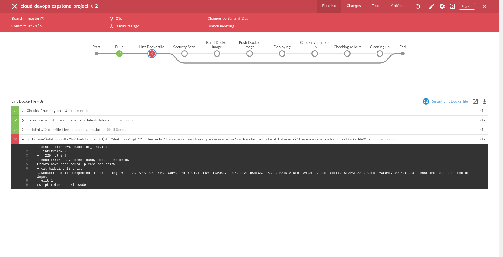
   
   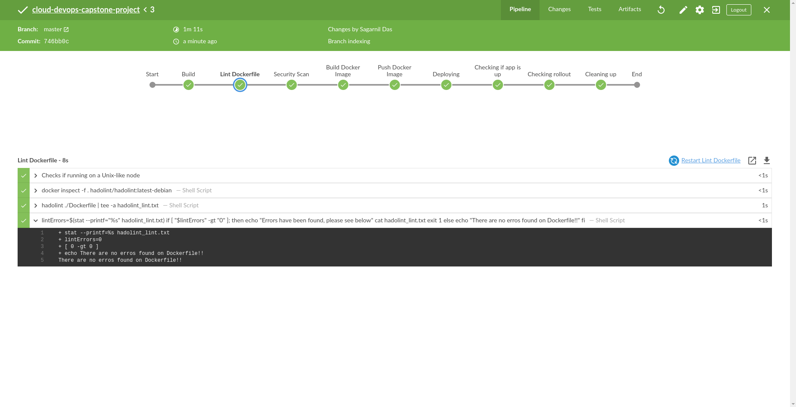
   
   - Run Security scanner via the aqua microscanner plugin on the docker image
   
   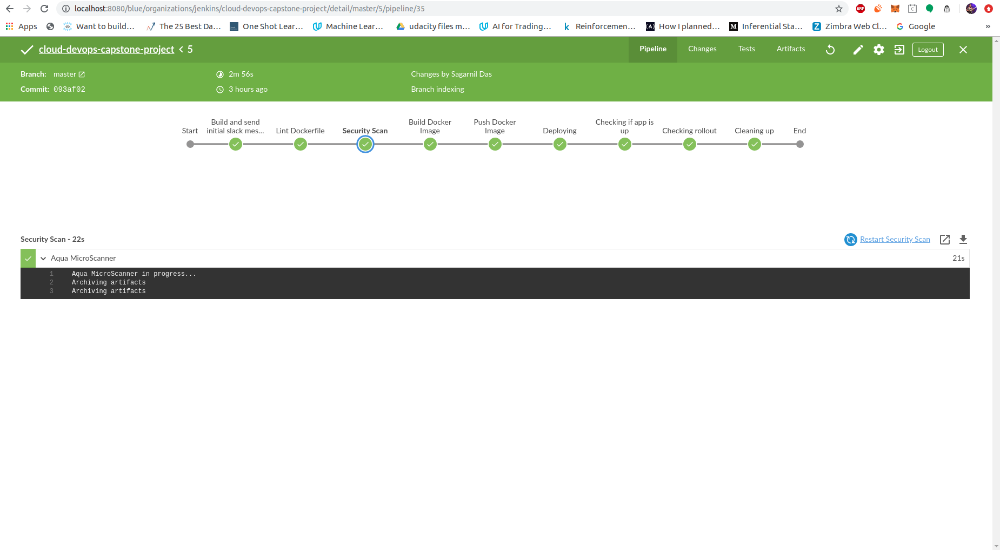
   
   - Builds and pushes the docker images to dockerhub.
   
   - This next step is a multi-step process. This is where we create the kubernetes deployment from the docker image and also create the load balancer service which operates on the three worker nodes we deployed earlier through the capstone-k8s.yaml file. The load balancer gets deployed as a service with an external IP. This is where we will find our app at port 9080. The following diagram shows the deployment step and also that the worker nodes instances are up and running which are autoscaled.
   
   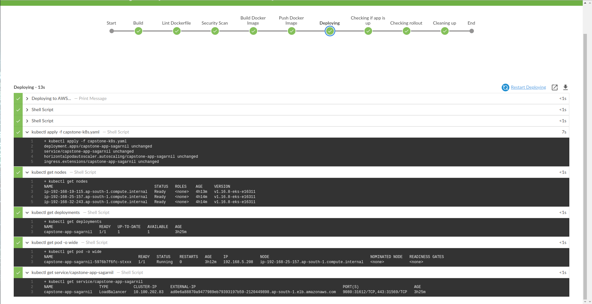
   
   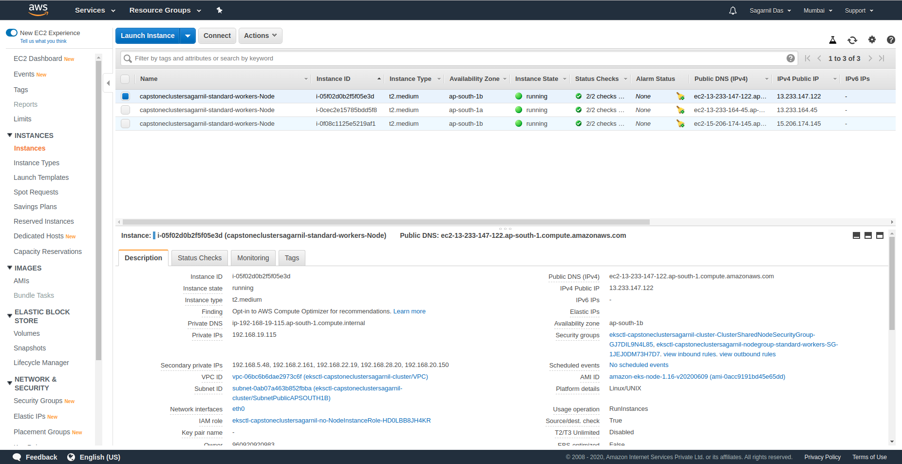
   
   - As post deployment steps, we first check if the app is up and running by doing a curl at the DNS of the loadbalancer followed by the port number - 9080. We also send a slack message if the app is up.
   
   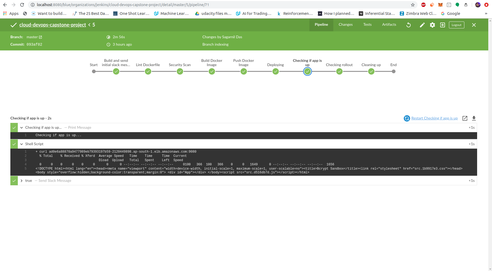
   
   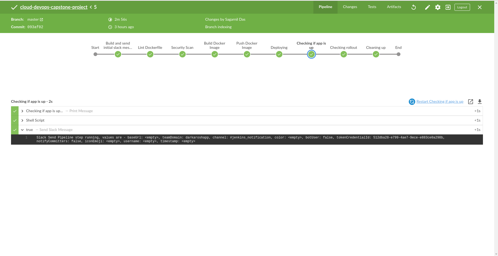
   
   - Next we check if the app succesfully rolled out or not.
   
   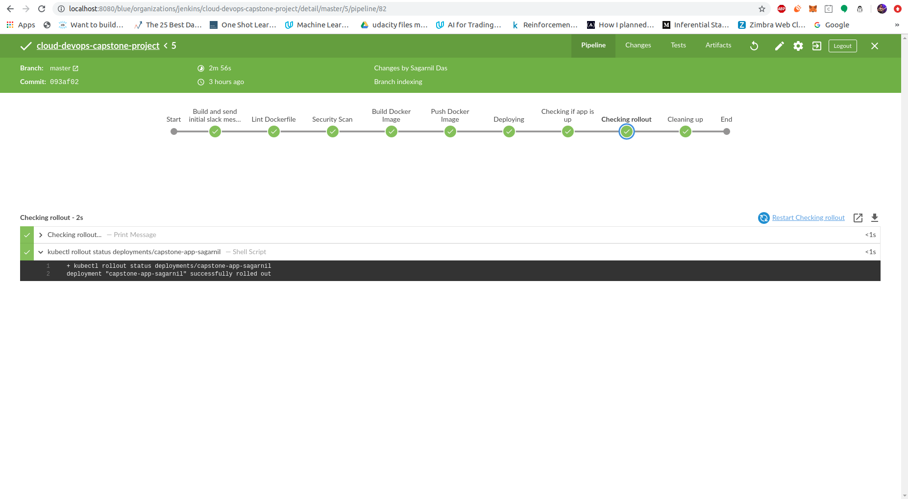
   
   - Finally we clean up the container environment by docker pruning.
   
4. Now our app is up and running at the DNS of the load balancer at port 9080.
   
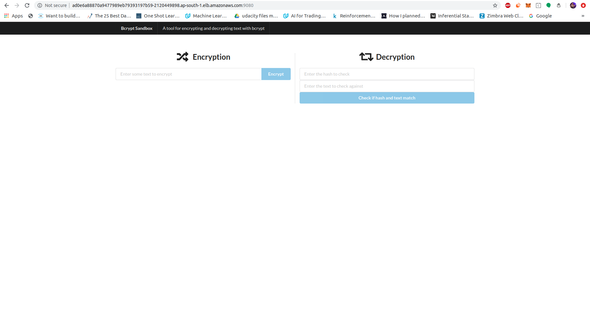

5. Before running the pipeline, we also configured jenkins globally to send slack messages for different scenarios.

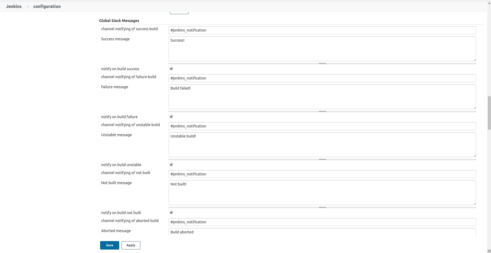

6. The following screenshot shows all the messages obtained in the slack channel (at the beginning, at the end and also if the run failed.)

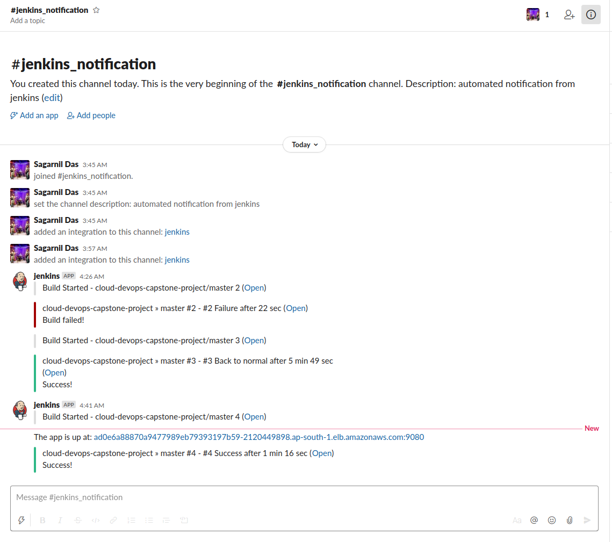

7. As a final step, we registered a domain in route 53 and in the hosted zones, we created a new record set where we create an alias for the DNS name of the loadbalancer so that it can be memorized easily by people without having to remember a huge DNS name.

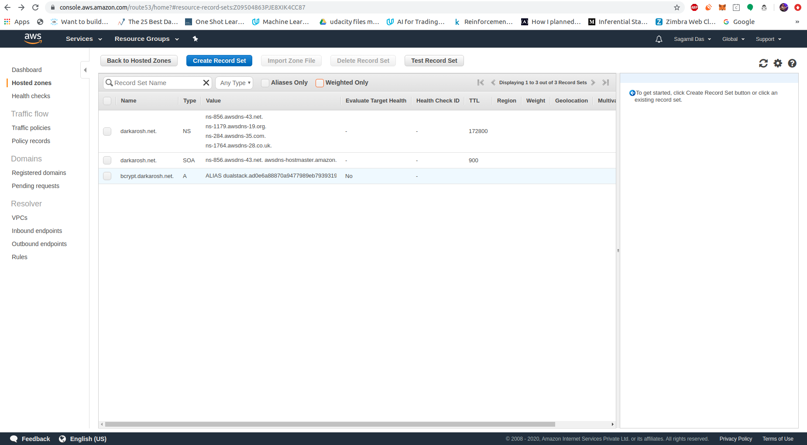

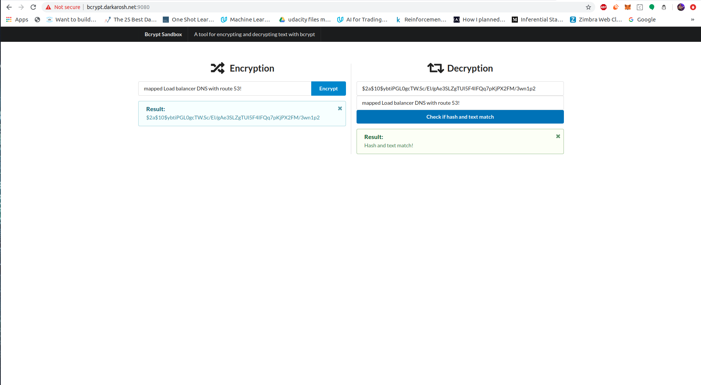


And VOILA! We have a web app running on distributed kubernetes cluster in a dockerized manner at a custom web address!
