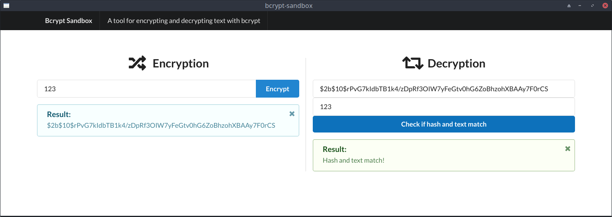

# Bcrypt Sandbox

A tool for encrypting and decrypting text with bcrypt.

## Running and Building

After cloning this repository, you can use the following commands:

| Command         | Action                            |
| --------------- | --------------------------------- |
| `npm start`     | Start the app in development mode |
| `npm run build` | Build the web app for production  |
| `npm run serve` | Start a production web server     |

## License

The MIT License  
<http://victor.mit-license.org>
